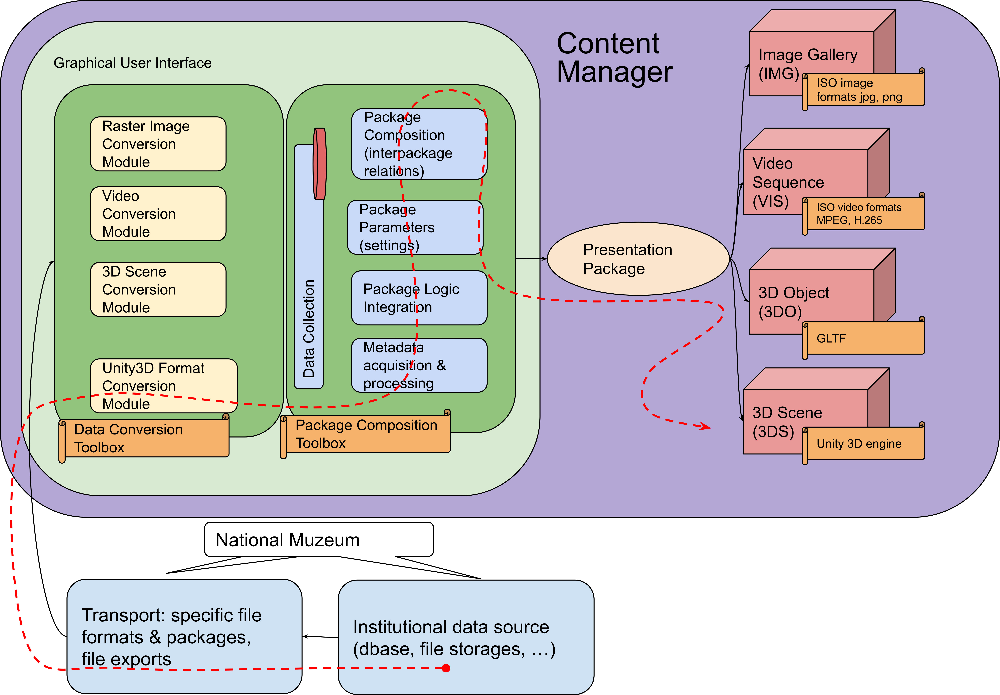

# Správce obsahu (Content Manager)

Spr8vce obsahu (CM) je samostatná aplikace, jejímž účelem je poskytovat prostředí a nástroje pro konverzi
a přípravu vstupních multimediálních dat (zejména ale 3D modelů) určených pro prezentování návštěvníkům prostřednictvím
kompatibilních zařízení (aktuálně viz [Interaktivní projekční stěna - IPS](https://github.com/iimcz/ipw-firmware)). Produktem Správce obsahu je
tzv. prezentační balíček, který obsahuje vlastní data (např. 3D model) a další pomocné instrukce a popisné informace.
Aplikace spravuje pracovní databázi v níž eviduje data k vytvářeným prezentačním balíčkům a z níž pak generuje výstupní balíčky.

## Architektura

CM je rozdělen na dvě části:
- [Frontend](https://github.com/iimcz/cmtoolbox/tree/master/frontend) - Aplikace založená na frameworku Angular, poskytující webové rozhraní CM.
- [Backend](https://github.com/iimcz/cmtoolbox/tree/master/backend) - Serverová aplikace, která zprostředkovává samotné zpracování dat a tvorbu balíčků, založená na ASP.NET Core.

## Dokumentace

Celková dokumentace Správce obsahu je dostupná zde:

[Systém správy 3D modelů pro účely jejich prezentace - Dokumentace](https://raw.githubusercontent.com/iimcz/cmtoolbox/master/docs/cm_dokumentace.pdf)
